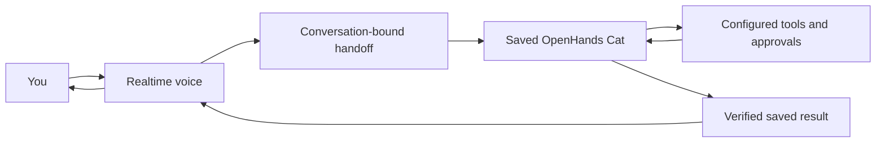

# Insider Cat

A Cat-first Projects page and a durable companion for **Agent Canvas**. Insider Cat
is a sibling of SmolPaws, with its own conversation and the capabilities supplied
by its configured agent profile.

This repository includes the prepared browser bundle, source, skill,
translations, and tests. Building or installing it does not require Odie's source
checkout.

## Install in Canvas

Open **Customize → Apps → Add app** and enter:

| Field           | Value                            |
| --------------- | -------------------------------- |
| Source          | `github:enyst/insider`           |
| Ref             | `main`, or a reviewed commit SHA |
| Repository path | Leave empty                      |

Installation starts disabled. Review and enable **Insider Cat**, then open
**Projects** at `/extensions/insider-cat/projects`.

Use a local Agent Server connection with the Apps endpoints and profile launch
additions available. Canvas Apps do not currently support cloud backends. Apps
run as trusted code inside Canvas and use authenticated requests to their owning
backend.

For local development, Source can instead be the absolute directory of this
repository on the **Agent Server machine**. Leave Ref and Repository path empty.
The backend copies the prepared `extension.js`; it does not install npm
dependencies or run a build.

## What it does

- Put the Cat, its messages, and **Talk** at the center of the page. The SVG Cat
  rests, wakes, listens, speaks, and works as its state changes. Conversation
  browsing sits under **Your work**; the page has one set of voice controls.
  The September 19, 2026 redesign supports reduced motion and keeps errors and
  approval requests visible as text, alongside the Cat's pose.
- Browse conversations with workspace and title/ID filters, manual refresh, and
  explicit pagination. Filters apply to loaded conversations; the page shows its
  coverage. Approval requests, errors, paused work, and ended runs have distinct
  labels. An ended run is not a claim that a task succeeded.
- Select work using its full conversation ID without replacing your draft.
  Opening a conversation stays inside Canvas.
- Discover saved Cat controllers across all conversation-list pages. A single
  controller resumes automatically; multiple controllers require a choice.
  **New Cat** creates a separate controller on the first send.
  The App remembers the last chosen controller for its backend and organization,
  then verifies its Insider tags when loading it again. `/new` prepares a fresh
  Cat without sending that command to the previous conversation. Controllers
  must be top-level conversations with both `smolpaws: insider` and
  `insiderrole: controller` tags.
- Create the controller using the active **OpenHands agent profile** and its
  workspace, preserving the user's confirmation policy and security settings.
  The [Insider skill](skills/insider-cat/SKILL.md) is embedded in its launch
  instructions without changing the stored profile.
- Continue the controller through the normal conversation API. Messages and
  replies are saved on Agent Server. The panel displays text from the latest 50
  events and links to the full conversation for older history, tools, and
  approval controls.
- `/condense` condenses the selected controller without changing its identity or
  starting another agent turn. Resolve running work or approval requests first.
  Requesting compaction from the App or the updated regular Canvas view ends
  that Cat's active voice call, even if compaction later fails. Click **Talk**
  after it completes to load the current context. Opening the full Cat
  conversation and returning to its App page keeps the same conversation ID.
  Automatic call cleanup for regular-view compaction requires the host's
  `onConversationContextChangeRequested` capability. Without it, end voice
  before compacting in the regular view and restart afterwards.

Selecting a worker provides context to the Cat; it does not send that worker a
message. Coordination depends on the tools supplied by the chosen profile. This
App adds no worker dispatcher, scheduler, or shared SmolPaws memory.

Drafts survive navigation while the App remains active. They are not saved
across browser reloads, App disablement, or backend switches. If a send has an
uncertain outcome, inspect the saved conversation before sending again. Leaving
the page stops its history polling without cancelling work already accepted by
the server. Away from Projects, the companion checks the Cat's status every
2.5 seconds while running, or every 10 seconds otherwise.

## Voice

The realtime model listens and speaks. The **saved OpenHands Cat** owns the
conversation, reasons about requests, and runs the tools configured for that
agent. Its ID stays the same when you switch between Voice and typed chat.



Conceptually the handoff is `ask_agent(request)`. The OpenAI API transport calls
it `send_to_insider`; the Codex transport receives `handoff_request` and dispatches
it directly on the server. This is not another tool the saved Cat needs to call:
it is already the agent receiving the delegated request. Do not wire task
execution to the SDK's similarly named `/ask_agent` endpoint: that endpoint asks
a stateless question without saving a turn or running the normal agent loop.

**Tools are a separate requirement.** A real OpenHands agent can have an empty
workspace tool list and only built-in utilities such as `think`, `switch_llm`,
and `finish`. Switching an LLM profile changes its model, not its tools. Choosing
an agent profile for new conversations does not retrofit an existing Cat. Inspect
the saved conversation's actual configuration when diagnosing missing tools.

The Cat should have the normal OpenHands tools and enabled skills, including
`openhands-api`. With its terminal, that skill, and accurate runtime information
for the owning backend, it can query Agent Server directly. Dedicated tools for
counting or coordinating conversations are optional conveniences. They are not
a prerequisite for API access through the terminal. The profile and runtime
must actually supply these capabilities; a saved conversation created without
tools or skills does not acquire them merely by connecting Voice.

For a total, query the backend's conversation-count endpoint. For a list, follow
pagination. Counting loaded cards is not counting the backend. A filesystem
count is meaningful only when the persistence path is confirmed to belong to
that local backend, and counts conversation records rather than message events.
API calls must use the supplied backend and configured authentication source,
without exposing credentials. Worker creation and messaging follow the user's
existing authorization and approval policy.

New Cats inherit advertised `runtime_services` from their owning backend's
`/server_info`. Agent-side URLs and authentication environment-variable names
are added to the launch context; credential values are never copied. The host
must advertise its actual services and provide the referenced environment or
key file to the agent. Missing metadata does not prevent launching a Cat, but
the agent must establish the connection before claiming backend access.

For now, both voice transports instruct the realtime model to delegate every
new request, including greetings and recall, so conversation ownership stays
clear. Fast acknowledgments can remain in Voice. Allowing Voice to answer small
talk independently is a future UX choice that also needs deliberate transcript
persistence; it must not create an unsaved second conversation.

### Provider setup and verification

Agent Server selects the voice provider: OpenAI API or Codex. Provider labels
stay out of the conversation controls. Both use WebRTC and keep the saved
OpenHands Cat as the task controller. The server handles authentication and the
SDP exchange; the browser receives no provider credentials.

The OpenAI API transport uses `gpt-realtime-2.1` and requires a standard OpenAI
API key. This transport does not use a ChatGPT subscription session or assume
subscriptions include API access.
Add a secret named `OPENAI_API_KEY` under **Settings → Secrets** on the owning
backend, or configure that environment variable on Agent Server. The missing-key
message links to Secrets. An agent profile's separate model credential is not
automatically reused for voice.

The experimental Codex transport requires an updated Agent Server configured
for Codex and a working Codex installation and sign-in on that server. Codex
provides audio. Agent Server takes the explicit `input_transcript` from each
`handoff_request` and forwards it to the saved OpenHands Cat, at most once per
`handoff_id` within that call. Dispatch no longer depends on a reasoning model
choosing a tool. The server waits for the saved Cat's run to settle and returns
its verified answer through `appendSpeech`. The pinned app-server may still
start a background Codex turn, but it has no tools and does not dispatch requests
or supply the spoken answer. The browser never resubmits Codex handoffs or
transcripts to the Cat. There is no automatic fallback to the API-key transport.
Codex starts from the saved Cat context; the Projects page's selected worker is
not added to that voice session. Live must still emit a handoff; this is not a
guarantee that every utterance is saved.

On Agent Server, set `OH_VOICE_PROVIDER=codex`. The prototype supports the
tested `codex-cli 0.154.0` executable. It uses a dedicated Codex home under the
server's persistence directory; `OH_CODEX_VOICE_HOME` can select another
dedicated directory. Keep the relay's configuration in that directory.

As of September 16, 2026, an existing file-store sign-in can be shared with
explicit user authorization: symlink only the dedicated home's `auth.json` to
the existing Codex `auth.json`, and set `cli_auth_credentials_store = "file"`
in the dedicated configuration. Do not copy tokens or link the ordinary home's
configuration, plugins, or MCP servers. The pinned 0.154.0 file-store save follows
the symlink, so refresh updates the shared session file. This setup depends on
that save behavior and does not apply to keyring storage.

The September 19, 2026 setup uses these settings in the dedicated `config.toml`:

```toml
model = "gpt-5.6-luna"
model_reasoning_effort = "high"
cli_auth_credentials_store = "file"
```

The model and effort select the Codex background thread, not the Live audio
model or the saved Cat's separate agent profile. A real text-only Luna/high
subscription probe completed successfully. The settings remain unchanged by
the direct handoff implementation.

Historical verification, September 16, 2026: the previous tool-based relay used
GPT-5.5 with low effort, and the saved Cat also used GPT-5.5. Three generated
spoken requests reached `send_to_insider`, produced saved requests and answers,
and returned through `appendSpeech` across two real calls using an existing
Codex ChatGPT sign-in. The same peer survived opening the regular conversation;
a fresh call correctly recalled the updated test word. An earlier trial had
answered from Voice history without saving a new request. On September 19, the
Luna/high relay received a handoff but completed without choosing
`send_to_insider`, so no request reached the Cat. That failure motivated direct
server dispatch. A real WebRTC test of the direct path on September 19 saved
one request and its Cat answer, then returned that answer as spoken audio.
A fresh call on September 20 then recalled the test word from that same Cat,
saved its new question and answer, and spoke the correct word. Both calls used
generated speech, the existing Codex sign-in, and a Luna/high Cat.
A further September 20 check repaired an early saved Cat that had no workspace
tools. Adding the standard tools preserved its ID, model, approvals, and all
existing events. A generated spoken calculation then produced an actual terminal
action and observation, a saved answer, and the matching spoken result. Voice
also emitted a misleading waiting acknowledgment before that result; progress
speech still needs refinement. A subsequent repair restored the eleven bundled
default skills and accurate backend/authentication context to that same Cat,
preserving its saved events. A real spoken backend-count request then invoked
`openhands-api`, discovered the live API through the terminal, queried
`/api/conversations/count`, saved the answer, and returned matching spoken audio.
An independent API check agreed. This verifies the existing terminal-and-skills
path for backend inspection; worker creation and messaging need their own live
checks before claiming those flows are verified.
Physical iPad microphone and speaker behavior remain device checks.

Call status includes fixed `error_code` values: `request_not_sent` means the
request was not admitted to the saved Cat; `relay_failed` means its outcome
needs checking in the chat; `connection_failed` identifies a connection or
protocol failure. The App maps these codes to translated messages and never
displays arbitrary backend error text. Missing or unknown codes also show a
connection error. A second handoff received while the Cat is still working is
reported as unsent, without cancelling the first request.

If no suitable existing session is available, use Codex's normal login flow in
the dedicated home, for example:

```sh
CODEX_HOME=/path/to/insider-codex-home codex login --device-auth
```

Use that same directory for `OH_CODEX_VOICE_HOME`. The relay rejects the ordinary
Codex home itself and enabled MCP configuration, disables unrelated tools, and
uses an ephemeral thread per call. A successful sign-in does not by itself verify
voice entitlement; test a call on the account.
The device flow can be approved from an iPad; ordinary browser login uses a
localhost callback on the server machine. Keep its one-time code private.
Long saved answers use a spoken excerpt from the beginning, with a notice that
the full answer is in the conversation. The saved answer remains complete.
The browser's missing-sign-in message appears before microphone access.

On a Canvas version with companion controls, choose a saved Cat and select
**Talk**. Choose a saved conversation, or select **New Cat** and send the first
message to create one.
Availability is checked before requesting microphone access.
The Cat page shows the call state and **Live transcript**. A compact companion
appears only away from Projects, keeping the call controls available without a
second voice panel on the Cat page. Navigation preserves the same audio element,
connection, and Cat identity. The transient transcript does not replace the
saved Cat history. **Mute**, **Unmute**, and **End call** work with both providers.
**Stop speaking** is available for the OpenAI API transport; Codex's current
app-server API does not expose this operation, so the button is hidden in Codex
mode. Ending a call or interrupting speech does not cancel accepted agent work.
Changing Cat, starting a new Cat, changing backend, disabling the App, or ending
the call releases the microphone and closes the connection. Returning to the
same Cat page keeps the call connected.

For the OpenAI API transport, the browser relays the voice model's
`send_to_insider` requests into that Cat's saved conversation. It waits for the
backend to confirm that the complete agent run,
including stop hooks, has settled with a `finished` status, then reloads the
saved answer. A proposed finish event alone is insufficient. If the broker
cannot verify the run's completion, the App directs the user to inspect the
conversation instead of speaking a proposed answer. It has no independent worker
dispatcher; approval requests are handled in the full conversation. Delegated
requests and controller replies are durable. The OpenAI API transport does not
separately save exact audio or the full voice transcript.
Typed chat remains available when voice is disconnected or unconfigured.

The [behavior and architecture notes](https://enyst.github.io/arch/insider-cat.html)
cover the App's behavior, architecture, and design direction.

## Development

Use Node.js 24.15 or newer in the 24.x series (CI uses Node 24), or Node 26+:

```sh
npm ci
npm run build
npm test
```

Edit `src/extension.js` for App behavior, `i18n.jsx` for language integration,
the local translation catalog for copy, and `skills/insider-cat/SKILL.md` for
controller guidance. The catalog retains all 15 Canvas languages.

Commit the rebuilt `extension.js` with source changes. The build test verifies
that the installed entrypoint matches the source, translations, and skill. The
bundle contains its dependencies and styles; it needs no other runtime files,
skin server, or iframe.

Tests use simulated conversations and do not call a live model or microphone.
They cover durable conversation identity, pagination, draft and target handling,
confirmation settings, uncertain requests, lifecycle cleanup, localization,
same-ID resume and condensation, and simulated WebRTC interruption/cancellation.

## License

[MIT](LICENSE). See [NOTICE.md](NOTICE.md) for source attribution and bundled
dependencies.
